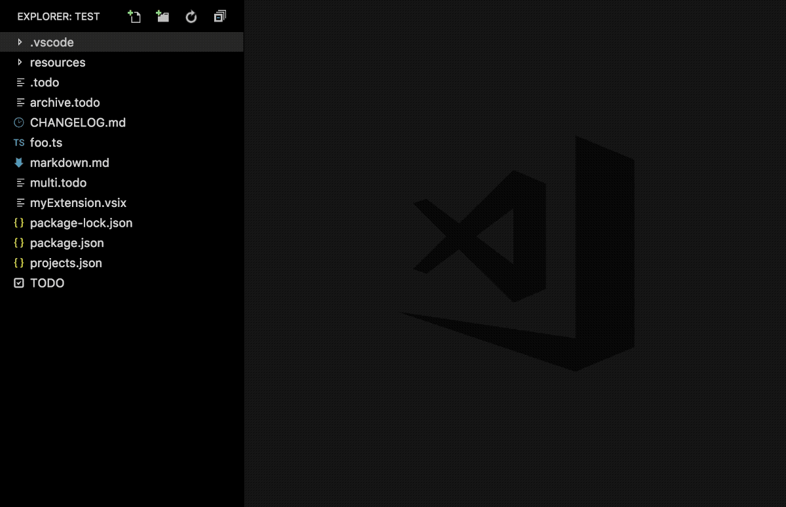

# Open Multiple Files

<p align="center">
	
</p>

Open all files in a folder at once, optionally filtering by a glob.

You can read more about the supported glob syntax [here](https://code.visualstudio.com/docs/extensionAPI/vscode-api#GlobPattern).

## Install

Follow the instructions in the [Marketplace](https://marketplace.visualstudio.com/items?itemName=fabiospampinato.vscode-open-multiple-files), or run the following in the command palette:

```shell
ext install fabiospampinato.vscode-open-multiple-files
```

## Usage

It adds 1 command to the command palette:

```js
Open Multiple Files // Open all files at once, optionally filtering by a glob
```

You can also right click a folder in the explorer and only search in that folder.

## Settings

```js
{
  "openMultipleFiles.limit": 100 // Max number of files to open
}
```

## Demo



## Contributing

If you found a problem, or have a feature request, please open an [issue](https://github.com/fabiospampinato/vscode-open-multiple-files/issues) about it.

If you want to make a pull request you can debug the extension using [Debug Launcher](https://marketplace.visualstudio.com/items?itemName=fabiospampinato.vscode-debug-launcher).

## License

MIT © Fabio Spampinato
